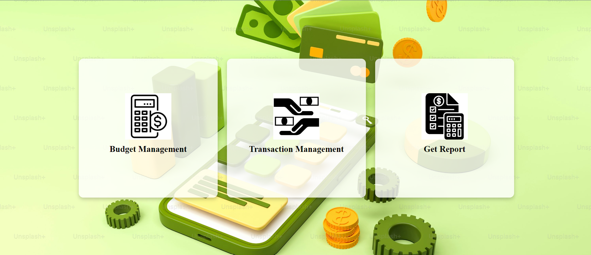

*******************************Pennywise Budget Tracker*************************
Introduction
The Pennywise Budget Tracker is a web-based application designed to help users manage their personal finances effectively. The system allows users to track their daily transactions, categorize them, and generate unique reference IDs for each transaction. With options to add, edit, and delete transactions, it provides a comprehensive view of one’s financial history. The application also allows for report generation based on the user’s transactions.

You can view the live project at: NA
Final project blog article:
Author(s) LinkedIn: linkedin.com/in/kevin-otieno-631469a9

**************************************Usage***************************************
Once the application is running, you can perform the following actions:

Add Transaction: Add a new transaction by specifying the date, amount, and category. The system generates a unique reference number.
View Transactions: View a table of all recorded transactions with their reference ID, date, category, and amount.
Edit Transaction: Update transaction details like the amount, category, or date.
Delete Transaction: Remove a transaction from the system.
Transaction Categories: Manage categories such as Food, Rent, Transport, Shopping, Clothing, and Medication.
The dashboard provides an easy-to-navigate interface with buttons for adding, viewing, editing, and deleting transactions.

We welcome contributions! If you'd like to contribute to Pennywise Budget Tracker, please follow these steps:

Fork the repository.
Create a new feature branch (git checkout -b feature-branch).
Commit your changes (git commit -m "Add new feature").
Push to the branch (git push origin feature-branch).
Open a pull request and describe your changes in detail.
Please make sure your code follows the project's coding conventions and includes tests where necessary.

